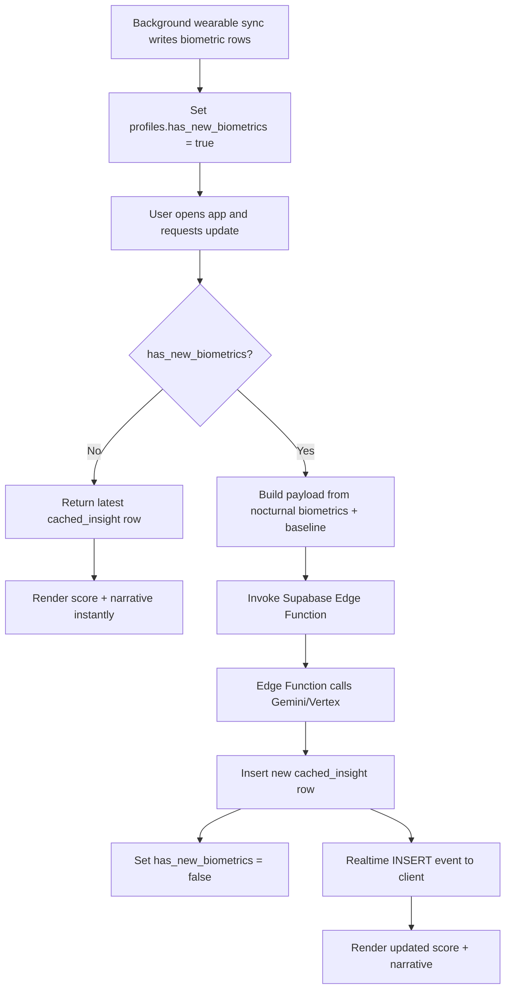

# Sardine Empire LLC FemTech App Architecture (Phase 2 Baseline)

This document is the technical and visual source of truth for Phase 2 planning.  
It defines the target architecture, product behavior, and cost-control guardrails before deployment or provisioning work begins.

## 1) Core Tech Stack & Data Flow

### Core stack
- **Frontend:** React Native with Expo and Expo Router.
- **Backend:** Supabase (PostgreSQL + Row Level Security + Realtime WebSockets + Edge Functions).
- **Wearable integrations:** Google Health Connect (Android) and Apple HealthKit (iOS).
- **AI engine:** Gemini / Vertex AI, invoked from Supabase Edge Functions only (server-side).

### Data ownership model
- **Supabase Postgres** is the system of record for biometrics, manual entries, cached AI output, and profile flags.
- **RLS** enforces owner-only data access, with explicit partner read-only policies where applicable.
- **Realtime** streams new analysis rows to the client after successful AI generation.
- **Client** never stores API keys for model providers; all AI calls happen in Edge Functions.

### Cache invalidation and AI-cost control flow
The AI engine must only be called when fresh biometric data exists.

### Noon background-fetch behavior (critical)
- App runs a **local background fetch at noon**.
- Noon fetch checks for new wearable data and local freshness status.
- If new data exists, app sends a **local push notification**: `"Tap to analyze your cycle"`.
- Noon fetch **does not call AI** and does not invoke Edge Function directly.
- AI execution is deferred until the user opens the app and triggers score update.

---

## 2) The Biometric Algorithm & Logic

### Baseline requirement and lifecycle
- The product uses a **60-day historical baseline** (approximately two cycles).
- Before a full baseline is accumulated, users are considered in the **Provisional** phase.
- Exit criteria from Provisional:
  - At least 60 days of historical nightly biometrics are available, and
  - Recent nocturnal data quality is acceptable for current-day interpretation.

### Strict biometrics scope (night only)
The algorithm must rely strictly on sleeping/nocturnal biomarkers:
- **Sleeping Temperature**
- **HRV (Heart Rate Variability)**
- **Lowest Sleeping Heart Rate**
- **Respiratory Rate**

No daytime activity metrics should influence fertility scoring logic.

### Scoring logic rules
- If new valid nightly data exists:
  - compare recent values against user baseline dynamics;
  - compute fertility score and narrative.
- If no new data exists:
  - serve latest `cached_insight` row only;
  - skip AI call.
- If recent data is incomplete but historical data exists:
  - return estimate flagged as provisional/estimated.
- Every generated analysis persists to cache for reuse and traceability.

---

## 3) UI/UX Design System

### Visual identity direction
- Product tone: clean, modern, calm, clinically trustworthy.
- Palette anchors:
  - **Sage greens** for fertile context
  - **Soft lavenders** for luteal context
  - **Muted corals** for menstruation context
- Surfaces should favor high readability, soft contrast, and low cognitive load.

### UI principles
- Mobile-first density with clear hierarchy and large tap targets.
- Insight-first design: score and plain-language narrative are always visible.
- Charts and calendar prioritize trend clarity over decorative complexity.
- Manual entry actions should be frictionless and never interrupt core review flow.

---

## 4) Navigation & App Structure (3 Tabs + Menu)

## Tabs

### Tab 1: Dashboard
- Shows:
  - current **Fertility Score**
  - short **AI narrative summary**
  - estimated **days until ovulation**
- Includes a witty CTA button: **"Update My Score"**.
- Cost-control behavior:
  - noon local background fetch checks freshness;
  - local push invites user to analyze when new data exists;
  - no AI call until user opens app and updates.

### Tab 2: Graphs & Analysis
- Default chart viewport: **14-day rolling window** with horizontal scroll.
- Overlays manual symbols (for example mood and intercourse entries).
- Fertile window shading and ovulation vertical marker line.
- Includes a concise AI narrative tied to currently visible trend context.

### Tab 3: Calendar
- Traditional month calendar view.
- Fertile days are shaded; manual events displayed as symbols.
- Tapping a date opens a **bottom-sheet modal** to:
  - review that day’s historical signals;
  - add/edit manual entries;
  - stay within Calendar context (no hard navigation away).

## Global Menu (required items)
1. **Wearable Sync** (Health Connect / HealthKit)
2. **Preferences**
3. **Partner Sync** (invite partner for read-only access)
4. **OBGYN / Clinic PDF Export** (60-day report)
5. **Subscription Management**
6. **About**

---

## Current Implementation Snapshot (for planning alignment)

- Existing app uses Expo Router + Supabase with cached insight and profile freshness flag.
- `cached_insight` table, RLS policies, and Realtime insert subscription are present.
- AI generation currently runs via Supabase Edge Function and Gemini API call.
- Current UI currently includes a Dashboard and placeholder second tab.
- Health Connect / HealthKit ingestion flows and full 3-tab target UX are not yet complete.

This gap is expected and accepted at Phase 2 kickoff; this document defines the target baseline for upcoming implementation.

